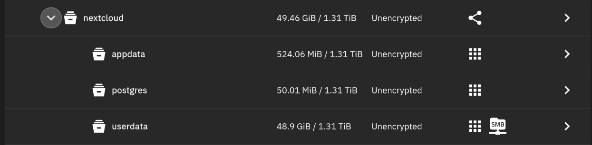
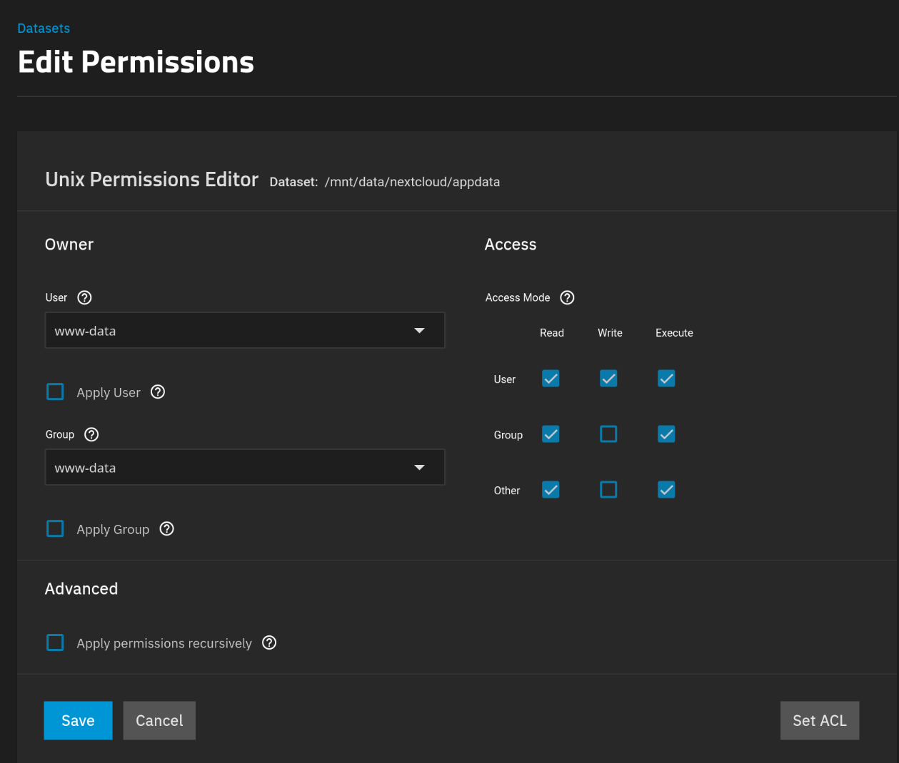
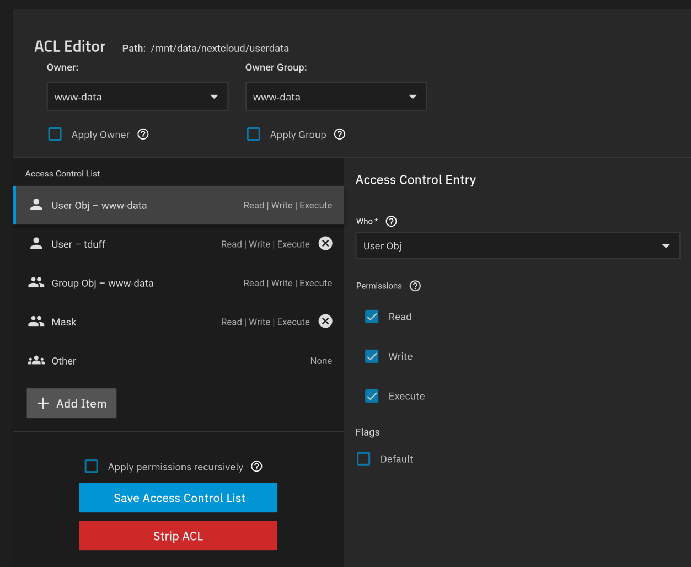
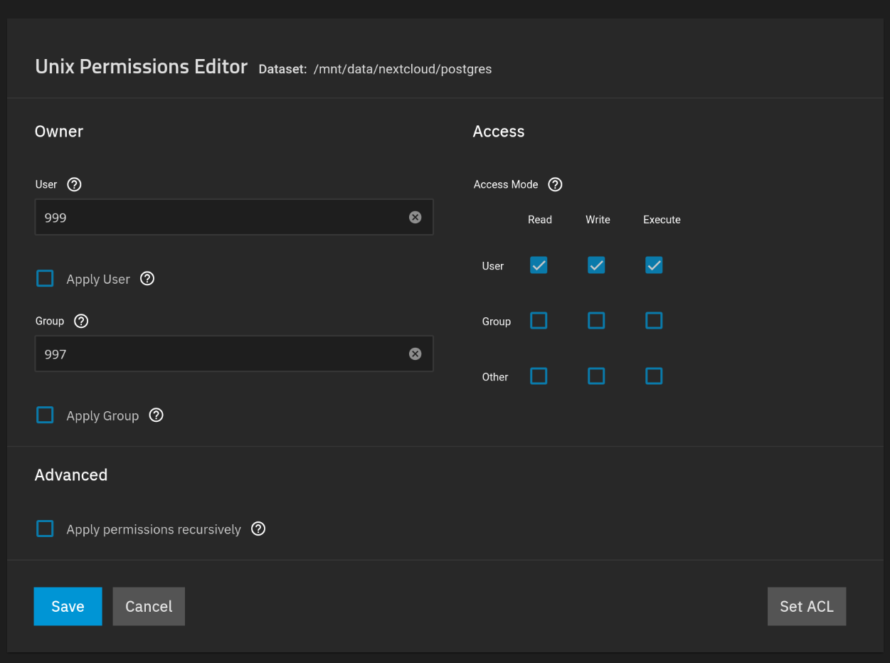
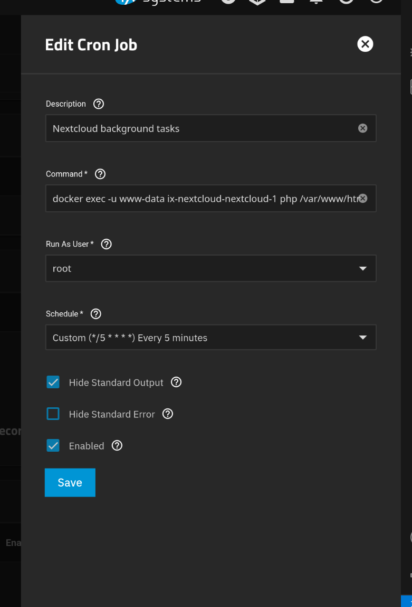

# The Problem

I'm pretty new to TrueNAS SCALE, and I'm even more new to docker and ZFS. As such, it was a total pain to get Nextcloud running because it has more explicit requirements than other docker containers I've used so far.

Your mileage may vary and it may not be the best/safest/most elegant approach, but it appears to work:
***

## Organising your datasets

All of the datasets created should use the Generic dataset preset.
Create a Dataset called `nextcloud`. We're going to use this to orgnise our child datasets but it won't actually do anything by itself.

Next, the `nextcloud` dataset and create three child datasets:

* `appdata` - This will store your config and customisation data.
* `userdata` - This is where your user's files are stored. I later enabled an SMB share here to transfer user backups (more on this later!).
* `postgres` - This is where postgres database info will live.

You'll end up with something like this:

***

## Applying your permissions

Select the `appdata` dataset, and then "Edit Permissions" on the side panel.

Set the owner user and group to `www-data`, and ensure you've checked "Apply User" and "Apply Data" or these changes won't apply even if you do save!

Ensure the access modes are set to allow read, write, and execute for the *User*. *Group* and *Other* can be given read and execute, and *not Write*. Don't forget to save!

For `userdata` this is identical, but I did set ACLs to give my SMB user total access to the dataset afterwards to allow file transfers. You can ignore this for first-time users.

The main difference is with `postgres`, which needs different permissions to function.

Use the owner user and group `netdata` for this (numerically these are 999 and 997 respectively if you're having troubl finding them). Only the owner needs RWX access here.

With that, you've got the annoying part over with!

***

## Installing Nextcloud

This installation assumes you're using the default TrueNAS app. If you want to use docker compose, you probably don't need this tutorial!

Pick an Admin username alongside a decent Admin Password. The password can be modified via the web UI later, but modifying the form when editing the container will do nothing after initial setup!

Set Host to your NAS' lan ip (for now). For me this was `192.168.0.47`. If you later set up a DNS name and reverse proxy, you should change this to reflect that host name (eg. `nextcloud.myhost.net`).

When setting a Redis Password and Database Password, note that these cannot be changed easily after setup.

Enabling [Imaginary](https://github.com/h2non/imaginary) is optional, but recommended for better performance when generating preview images. Note that you can't use this with server side encryption! :(

Personally, I slightly increased the PHP and cache memory limits from their defaults but realistically these are probably fine at their default values.

*Enable Cron*, it'll save you headaches later!

In the `Network Configuration` section do not select a certificate, at best set it to No certificate, but you can leave it untouched. You can use nginx proxy manager or other service to apply your certificates later!

In Storage Configuration:
Select `appdata`, `userdata`, and `postgres` in their respective sections as host paths.

From here, you should be able to spin up your container!

***

## Post-install setup

### Importing users

You should now be able to work out the rest, but for my case I wanted to transfer my existing (2) users and their data. This was going to be a royal pain in the arse until I discovered [user_migration](https://github.com/nextcloud/user_migration).

This nextcloud is pretty simple. You add it to your old and new server instances, then you can either:

a. Log in as each user and enter into `Personal Settings > Data migration`.

b. Use `occ user:export` in your server's CLI.

Both of which will start a background job to pack up your user's files and metadata into one big tarball that can be `rsync`'d between your machines super easily.

From there, it's as simple as running the import job from inside each user's profile on the new instance (assuming the `user.nextcloud_export` file is moved into their user's `username/files` directory), or you can use `occ user:import` which will create a new user if they don't already exist.

Expect this to take a *long* time, it's going to unrar, process, and log each file which also involves re-writing them to disk - on spinning rust this will can take over an hour for larger exports!

You might get some errors in the nextcloud log, but try not to worry as some of them will be due to Nextcloud file processing beating the database into a fine pulp. In my experience of a 50GB+ user import, it didn't result in lost data (but I'd still recommend you manually verify before deleting your old users!).

### Other steps and further reading

Whilst imports was a big one, I did a lot of other stuff to remove warnings, improve reporting, and hopefully performance & security.

1. Use nginx proxy manager to enable SSL and a nice domain name for my instance. You'll need to [add your domain to trusted_proxies](https://help.nextcloud.com/t/your-trusted-proxies-setting-is-not-correctly-set-it-should-be-an-array-of-ip-addresses-optionally-with-range-in-cidr-notation/194689) inside Nextcloud's config.
1. Add my [maintenance window](https://help.nextcloud.com/t/server-has-no-maintenance-window-start-time-configured/180480) and [phone region](https://help.nextcloud.com/t/your-installation-has-no-default-phone-region-set/153632/6) to the nextcloud config. These weren't set up in docker annoyingly.
1. Enabled cron. I missed this on my initial setup so I had to set it here. I noticed that even with it enabled, cronjobs weren't firing so I had to add `docker exec -u www-data ix-nextcloud-nextcloud-1 php /var/www/html/cron.php` via TrueNAS' cron settings (`System > Advanced Settings > Cron Jobs`): 
1. Added SMTP support [using gmail](https://support.google.com/a/answer/176600?hl=en)'s app passwords.
1. Addressed other errors and warnings in the nextcloud admin interface. Most of these are easily fixed and ~~googled~~ duckduckgo'd if you need help!
