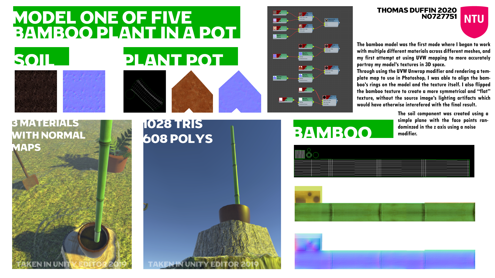
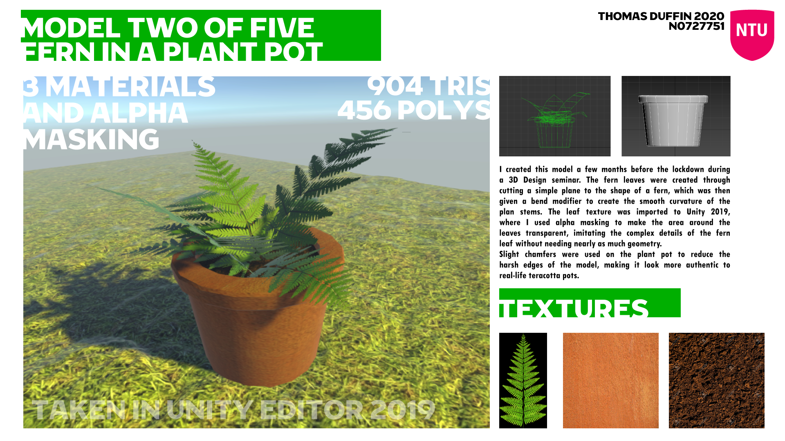
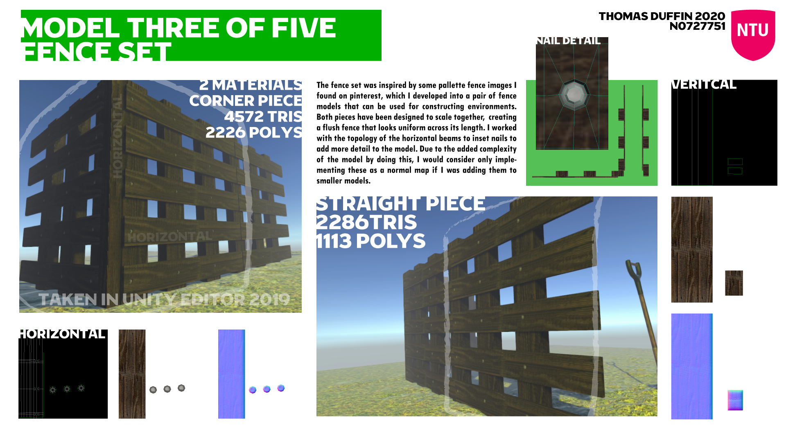
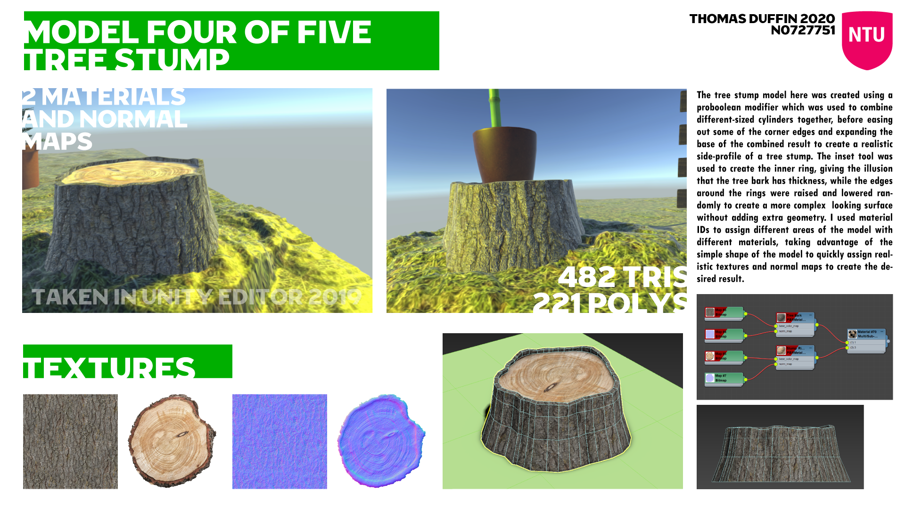
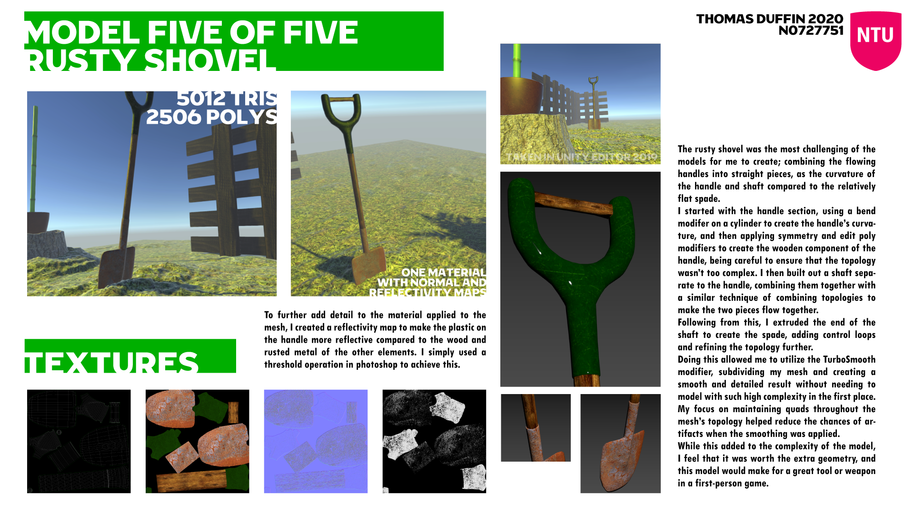

# About *Project Retrospectives*

Welcome to my first, of hopefully many, project retrospectives. I plan to go over all of my favourite projects from university and talk about the work I did for them in a little more detail than I did when I mass-uploaded my projects to github sometime in 2021!

## The Project

[[Github Link]](https://github.com/TDuffinNTU/2nd-Year-3DS-Max-Portfolio?tab=readme-ov-file)

Coming toward the end of 2019, I had already spent a few months working with Autodesk 3DS Max as part of my 3D Modeling module. We had to create a bunch of 3D models and document them on posters, showcasing our workflow and modelling skills.

Unfortunately, coming back to this project years later I've discoverred that the download link for the models themselves is dead :(, something I'll have to address in the future (maybe a second attempt? in Blender..?)

## The Models

The vague theme I had at the time was "plants". I enjoyed the seminars I had with making some ferns which inspired the rest of the models I developed going forward.

Organic models are much easier to design, especially since their forms and dimensions can vary - This gave me a lot of freedom to play about with meshes as I picked up the basics.

### Model 1, Bamboo pots

This was a no-brainer for me. It's a simple shape and incredibly easy to UV Unwrap and texture. I didn't really use too much source imagery here which is probably a source for improvement: Real bamboo actually has some leaves, too!

A fun detail here is the sections of the bamboo, subtly modelled to be wider than the rest of the stalk. Some Normal mapping helped with the effect.

### Model 2, Fern and Plant Pot

Like I said before, the seminars working through a similar model was the inspiration for this series.

I used alpha masking to turn my leaf texture into a convincingly complex shape despite being relatively simple to model.

### Model 3, Fence Set

Being part of my game design course, I wanted to consider how I could use my modelling skills to build 3D environments to be decorated with my other assets.

I think these could've come out looking a lot nicer, though; they're one of my less convincing models.

### Model 4, Tree Stump

This model was incredibly fun to produce. The jagged forms and subtle texture and normal-mapping makes this model fit naturally into complex 3D environments or as a backdrop for other props.

This piece was also a demonstration of my study of PBR materials, and the compositional process of applying one to a model in 3DS Max.

### Model 5, Rusty Shovel

This was by far my most complex model, from the complex geometry (far higher than my other models) to the combination of 3 different surfaces into a single PBR Material.

I'm proud with how this came out, especially with how difficult I remember extruding the cylindrical shaft of the shovel into the flat head, which required carefully controlling the thickness of the model to avoid it looking unnaturally thin or thick across the blade.

The unwrapping workflow in 3DS was quite intuitive once you understood the principle, so even this complex topology wasn't too bad to texture - Though I think I could've still tweaked things further!

## Conclusion

I think a lot about how different my career and life would be if I was given the opportunity to explore my creative side more often, especially in a digital space which has always fascinated me.

I'm quite proud of how well these came out all these years later - Part of me still wants to explore remodelling these in Blender and releasing them as game assets for others to enjoy.
