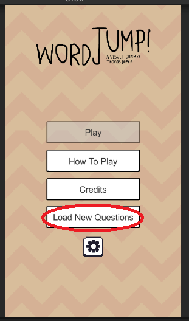

## VESVET And ISRG

As part of my 2nd year "Serious Games" Module, I produced a game in Unity/C# called "WordJump".

This project was submitted to the [Interactive Systems Research Group](https://www.ntu.ac.uk/research/groups-and-centres/groups/interactive-systems-research-group) and was eventually featured in their joint research report on how Serious Games can add value to Vocational and Educational Training (VET), in joint partnership with Erasmus+ nations.

> *VESVET is an EC Erasmus+ KA2 project with the aim to foster vocational education and training (VET) students’ employability, by enhancing entrepreneurship, competence development and validation.*
>
> *The project aims to improve professional entrepreneurial competences by means of a good professional orientation and of the internationalisation of the professional experience.*

-- **VESVET project brief**

>*The following serious games have been created by students at The Nottingham Trent University as part of their Computer Studies and Digital Media Technology courses. In the module Serious Games, the students have a project brief where they work with the research team to create a game that can be of added value to a research project. This page showcases the very best of the games developed by the students from both the 2020 and 2021 cohorts.*

-- **ISRG Report**

## Project

*WordJump* is heavily inspired by both *Duolingo* and *Doodlejump*. The basic gameplay loop of rising up the screen is intuitive and fun, whilst regular learning elements become a change to utilise how play is one of the most effective vehicles for learning.

In order to support the game's adoption into a classroom environment, the topics for revising are stored in a simple CSV file - You only need to add a few lines of CSV to change the subject entierly! These become the basis of the questions for revision, with LINQ used to deserialise and process the file to set the game's initial state.

On top of that, I utilised i18n plugins in Unity to allow for extension into other languages; in line with the goal of promoting the project's goals internationally. The game currently supports English 🇬🇧, Deustch 🇩🇪, and Cymraeg 🏴󠁧󠁢󠁷󠁬󠁳󠁿.

>In this game the player must jump up the platforms without falling off. Collecting coins opens questions which can be set using a simple text file that must be linked prior to playing the game. This makes the game highly versatile – meaning that a teacher can include any question set produced in a simple format as detailed here. The game shows a question and selects four answers – the correct one and three others randomly from the answers list.

-- **ISRG Description**

## Read more

1. <https://www.ntu.ac.uk/research/groups-and-centres/groups/interactive-systems-research-group>

1. <https://github.com/TDuffinNTU/wordJump-Serious-Games-Project>

1. <https://web.archive.org/web/20210603104212/https://isrg.org.uk/vesvet-added-value-games/>
